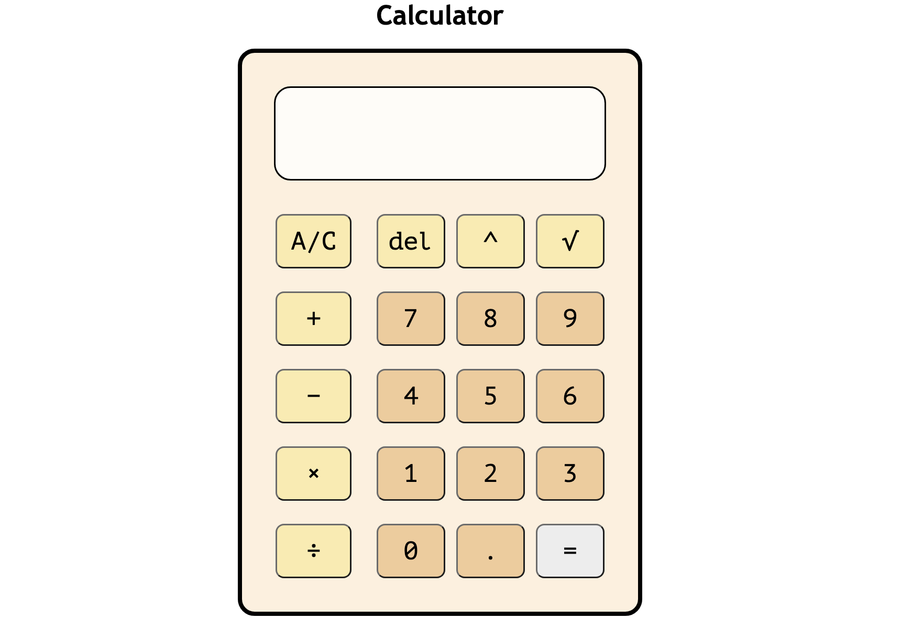

# The Odin Project - Calculator

This is a calculator webpage created as part of The Odin Project. The calculator allows you to string operations together to get the right answer, and the calculator can only evaluate a single pair of numbers at a given time. 

[🔗 Live Demo](https://ca-stella.github.io/odin-calculator/)

### Outcomes
- Gained a better understanding of JavaScript functions and structure
- Aimed to improve code readability
- Applied what I learned through the curriculum about mathematical functions in JavaScript
- Learned more about applying JavaScript to mathematical operations
- Used logical thinking to ensure that the calculator functions as expected and to improve user experience (e.g., ensure '=' cannot be pressed too early with JavaScript)
- Improved on structuring and formatting HTML and CSS elements
- Used Git and GitHub for overall project management

## Technologies & Resources Used
 &emsp;  &emsp;  &emsp;   
   

# Selection of previous work 
## Web Development 
### The Odin Project
- <a href="https://github.com/ca-Stella/odin-landing_page">Landing Page</a> [ HTML | CSS ]
- <a href="https://github.com/ca-Stella/odin-rps">Rock Paper Scissors</a> [ HTML | CSS | JavaScript]
- <a href="https://github.com/ca-Stella/odin-etch_a_sketch">Etch-a-Sketch</a> [ HTML | CSS | JavaScript]